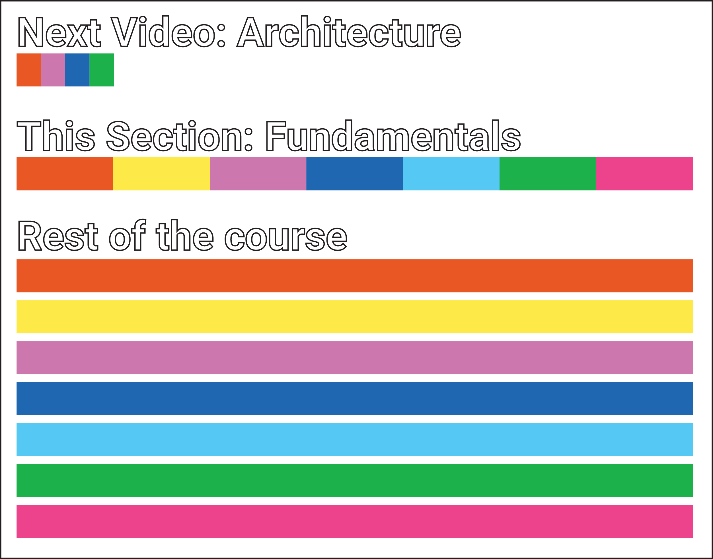

# Part 3 - Angular Fundamentals
## 0 - Teaching Method

The teaching method of this course: Repetition from simple to more complex, from overview into deep discourse.

Not everyone has the stamina to finish the entire course, so in this section we're going to present a bird's eye view of all the different parts of Angular and how these pieces fit together to create useful applications.

For example, the next video, "Architecture," is going to be a very brief introduction of the way the major pieces of Angular works.

In the next videos throughout this section, we're going to be exploring those pieces in a little more depth by building a simple application together using all these pieces. After this section, we're going to be going into each of these pieces in great detail. The sections after this one are intended to be used more as a "reference" as you need them, as you're writing your own applications. The best way to learn code is to GET STARTED NOW, not just using videos as a procrastinatory crutch.

The objective is to give you a "feel" for Angular, and how the pieces relate. And then once you have a solid "mental map" of Angular, we can zoom into the different parts of the map and fill in the detail AS NEEDED.

